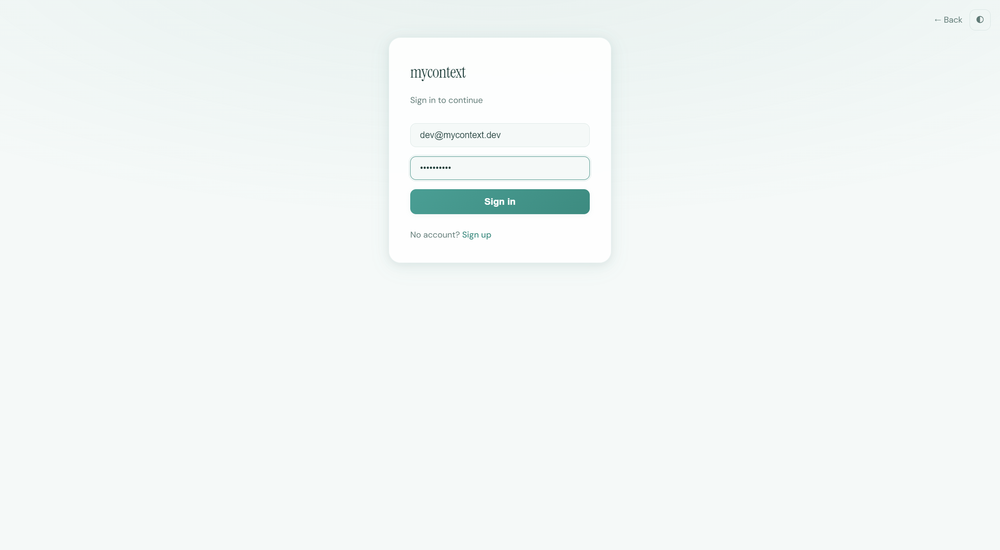
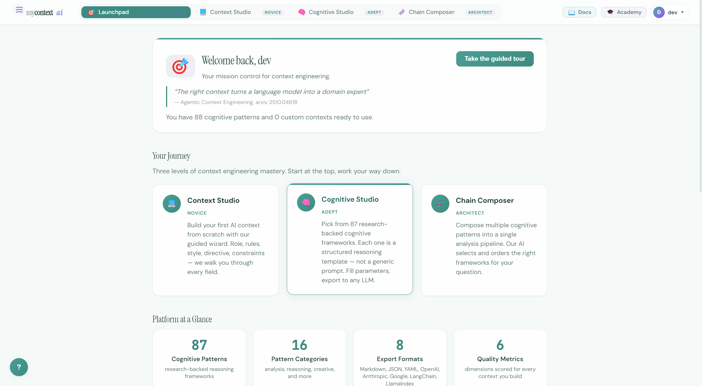
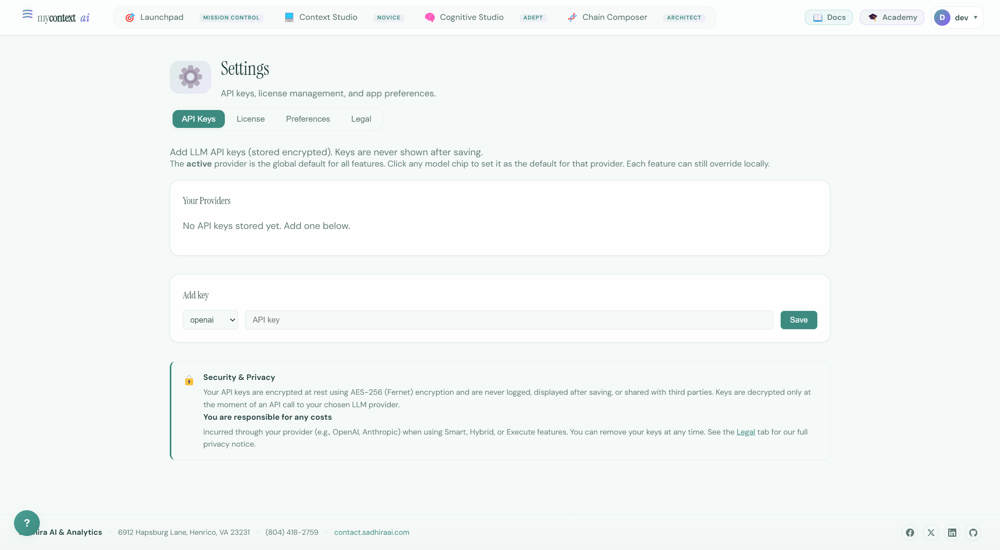
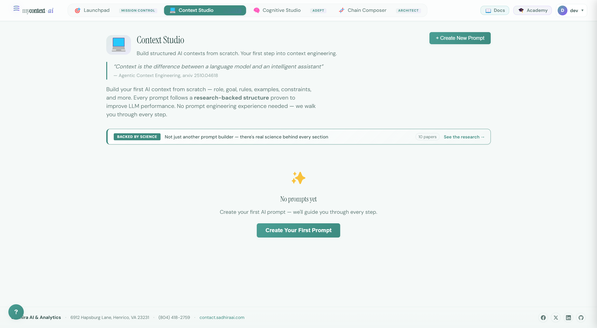
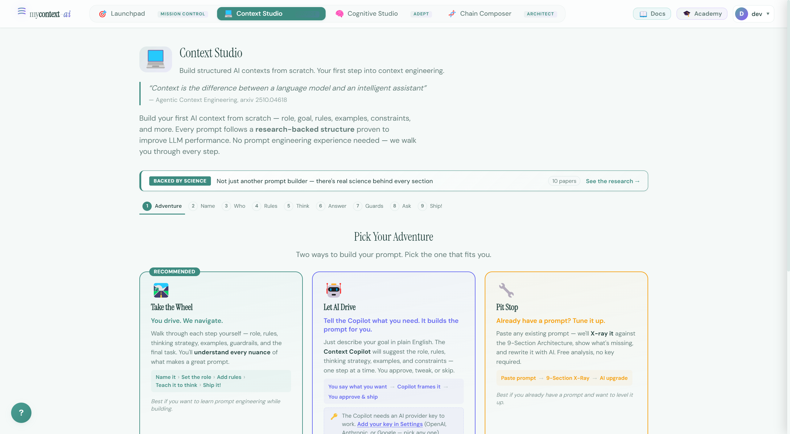
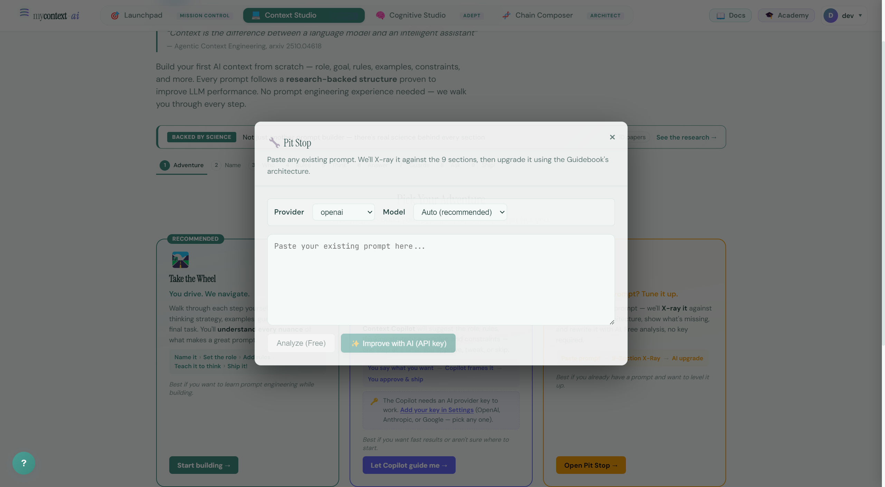
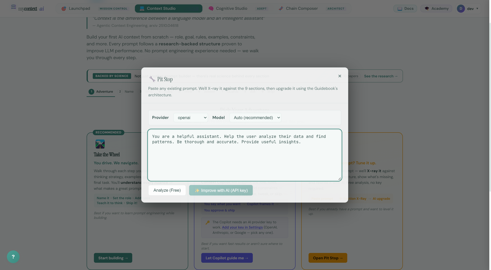
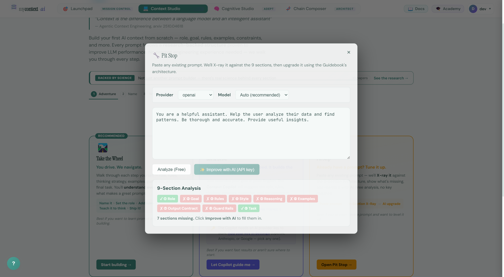

# UI Guide 01: Pit Stop — X-Ray Any Prompt, Then Auto-Build a Complete One

> **The X-ray is free — no API key.** With a provider key, *Improve with AI* automatically generates a full 9-section prompt from your paste.

---

## The Pitch

You've been using ChatGPT or Claude for months. You have prompts you've tweaked a dozen times. They work — sort of. Sometimes you get brilliant output. Sometimes you get garbage. You don't know why.

Here's why: **your prompt is missing structure.**

Most prompts have 1 or 2 out of the 9 components that make a great system prompt. They have a vague role and a task. They're missing: an explicit goal, behavioral rules, a thinking strategy, output format, guardrails, and examples. Each missing section costs you output quality.

**Pit Stop is an X-ray for prompts** — and optionally a builder. Paste anything in — a ChatGPT system prompt, something from Reddit, your own draft — and **Analyze (Free)** shows you exactly what’s present and what’s missing: a section-by-section diagnostic backed by the same 9-Section Architecture as the [mycontext Prompt Guidebook](https://mycontext.sadhiraai.com/guidebooks/prompt-engineering). No guessing. No vague “try these tips.”

When you’re ready to fix it, **✨ Improve with AI** (with your own OpenAI, Anthropic, or Google key) **automatically creates** a rewritten, complete system prompt — all nine sections filled, research-backed ordering, same pipeline as `PromptArchitect.improve()` in the SDK.

**Diagnose for free in the browser; let AI generate the upgraded prompt when you want the heavy lift.**

---

## Before You Start: Login and Settings

### Step 1: Log in

Navigate to the app and sign in with your credentials.



### Step 2: Explore the Dashboard

After login you land on the Launchpad — your mission control. Note the platform stats: **88 cognitive patterns, 8 export formats, 6 quality dimensions**. Everything here is research-backed.



### Step 3: (Optional) Add an API Key

Pit Stop's analysis is free and works without any API key. However, the **✨ Improve with AI** feature — which rewrites your prompt using the full 9-Section Architecture — requires an OpenAI, Anthropic, or Google key.

Go to **Settings → API Keys**, pick your provider, paste your key, and click **Save**.



> **Security note:** Keys are encrypted at rest with AES-256. They are never shown after saving and never logged. You're responsible for your provider costs — but the analysis itself is always free.

---

## The Pit Stop Walkthrough

### Step 4: Open Context Studio

Click **Context Studio** in the navigation bar.

You'll land on the Context Studio page. Notice the research citation at the top:
> *"Context is the difference between a language model and an intelligent assistant"*

This isn't marketing. The 9-Section Architecture is grounded in 10 published papers on prompt ordering, position effects, and instruction compliance. The **Backed by Science** banner links to all of them.



### Step 5: Open the Mode Picker

Click **+ Create New Prompt** to see the three modes.

You'll see:
- **Take the Wheel** — Manual 8-step wizard (Guide 02)
- **Let AI Drive** — Copilot-assisted building (Guide 02)
- **Pit Stop** — Paste → diagnose → improve *(you are here)*



Click **Open Pit Stop →**.

### Step 6: The Pit Stop Panel Opens

The Pit Stop panel slides open below the mode picker. You can see:
- A provider/model selector (for the AI improvement step)
- A textarea for your prompt
- **Analyze (Free)** — always available, no key needed
- **✨ Improve with AI (API key)** — requires a key



### Step 7: Paste a Weak Prompt

Let's test with a real-world example — the kind of prompt most people actually use:

```
You are a helpful assistant. Help the user analyze their data and find patterns. Be thorough and accurate. Provide useful insights.
```

This looks reasonable. It has a role ("helpful assistant") and a task ("analyze data"). But there's no goal statement, no rules, no thinking strategy, no output format, no examples, no guardrails. It will produce inconsistent, generic output every time.

Paste it in.



### Step 8: Click Analyze (Free)

Hit **Analyze (Free)**. The result is instant — no API call, no cost.



The X-ray shows:
```
✓ ① Role          — detected ("helpful assistant")
✗ ② Goal          — missing
✗ ③ Rules         — missing
✗ ④ Style         — missing
✗ ⑤ Reasoning     — missing
✗ ⑥ Examples      — missing
✗ ⑦ Output Contract — missing
✗ ⑧ Guard Rails   — missing
✓ ⑨ Task          — detected ("analyze data")
```

**7 sections missing.** That's not a bad prompt — that's a fragment of a prompt.

### What Each Missing Section Actually Does

| Section | What it unlocks |
|---|---|
| ② Goal | The AI knows what "done" looks like. It can self-evaluate. |
| ③ Rules | Behavioral guardrails enforced on every response. |
| ④ Style | Consistent tone, formality, audience targeting. |
| ⑤ Reasoning | Forces the AI to use a specific thinking strategy (e.g. step-by-step, multiple hypotheses). Research: Wei et al. 2022 shows reasoning instructions alone improve accuracy by 40%+ on complex tasks. |
| ⑥ Examples | Shows the AI the expected output shape. Position matters: Li et al. 2025 shows start-placed demos yield +6 accuracy points. |
| ⑦ Output Contract | Exact format specification. The AI follows this. |
| ⑧ Guard Rails | What to do when uncertain, when to refuse, what not to assume. |

### Step 9: Improve with AI (if you have a key)

With an API key configured, the **✨ Improve with AI** button rewrites your prompt from scratch — filling in all 9 sections using the Guidebook architecture. The rewrite uses the same `PromptArchitect.improve()` pipeline available in the SDK.

The result is a structured system prompt with all 9 sections, research-backed ordering, and section-specific guidance derived from 10+ prompt engineering papers.

---

## Why This Matters

The gap between a 2-section prompt and a 9-section prompt is not cosmetic. It's the difference between:
- An AI that guesses what you want vs. one that knows its exact mission
- Responses that vary wildly vs. ones that follow consistent rules
- Output you have to re-prompt vs. output that's right the first time

**The research:** Liu et al. (2023) showed LLMs recall best from the start and end of a prompt (U-shaped curve). The 9-Section Architecture places the highest-priority instructions (Role + Goal) at the primacy zone and the task at the recency zone — exploiting this bias intentionally.

**The PromptArchitect SDK** gives you the same analysis and improvement pipeline programmatically:
```python
from mycontext import PromptArchitect
pa = PromptArchitect()
result = pa.parse("You are a helpful assistant. Analyze data.")
# result.scores shows section-by-section coverage
improved = pa.improve(result)
# improved.prompt is the full 9-section rewrite
```

See **Notebook 01** and **Notebook 02** for the full code-based walkthrough.

---

## Next Step

Once you've diagnosed and improved your prompt in Pit Stop, the next move is to **build a prompt from scratch** — using the 8-step wizard or the AI Copilot. That's exactly what **UI Guide 02** covers.
