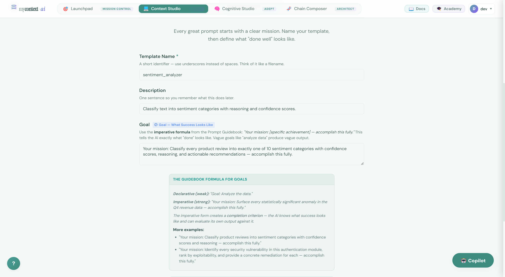
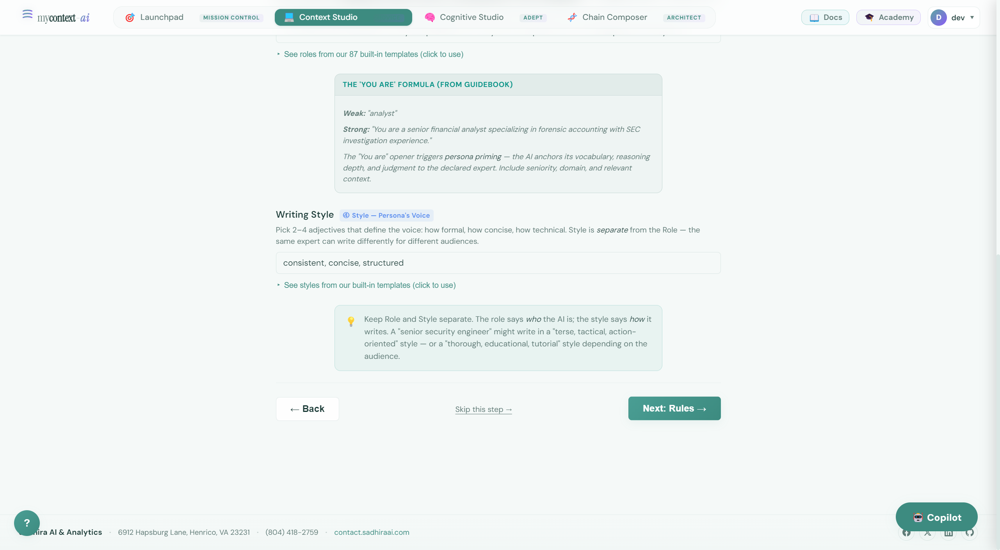
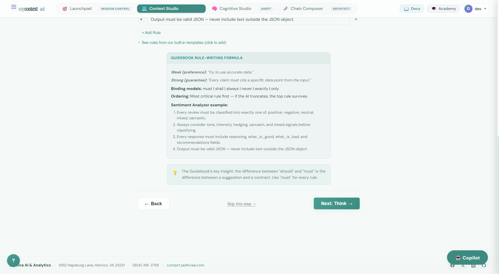
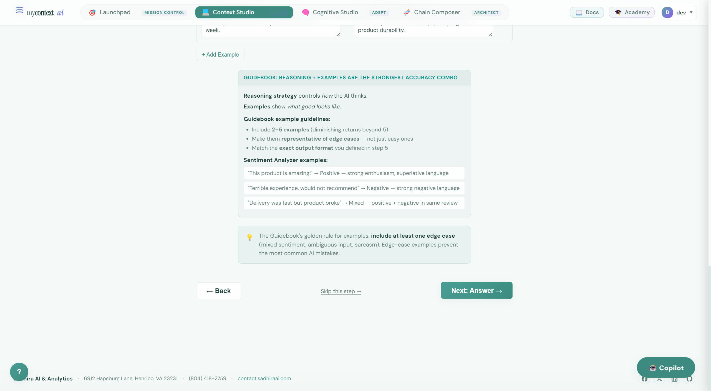
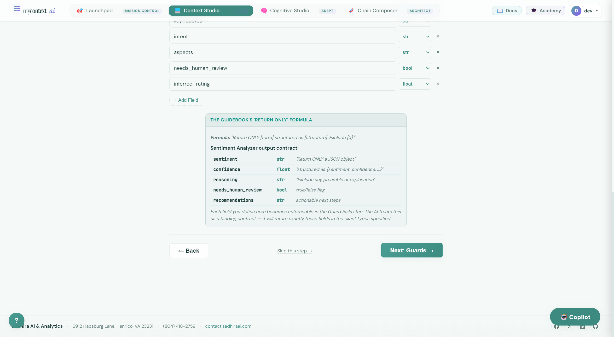
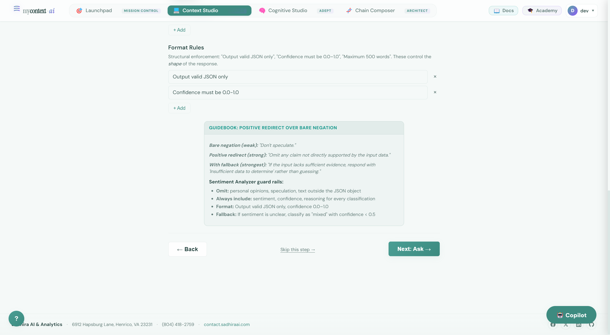
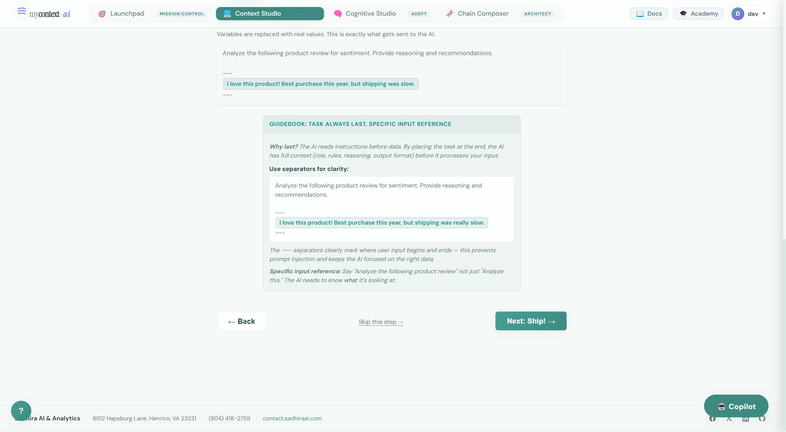
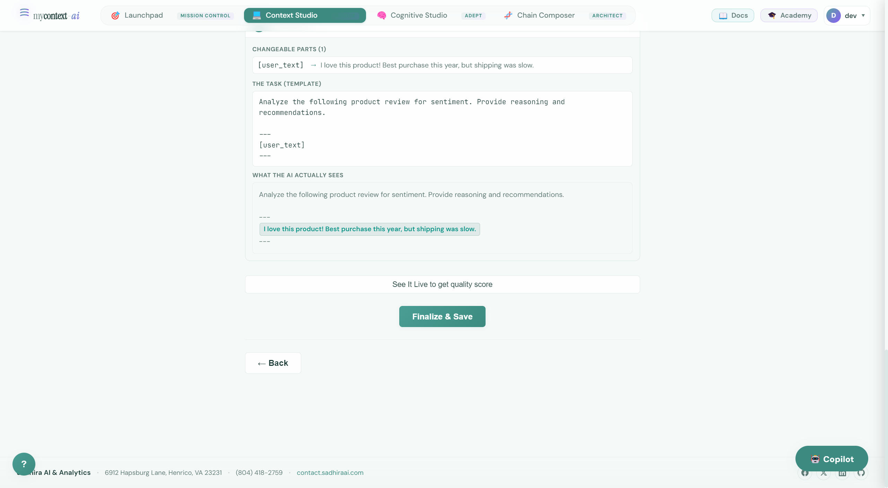

# UI Guide 02: Context Studio — Build Your First Production Prompt

> **Take the Wheel (manual) or Let AI Drive (Copilot). Either way, you end up with a research-backed 9-section prompt.**

---

## The Pitch

Every AI assistant tutorial says the same thing: "write a better prompt." None of them tell you *how*. What sections does a great prompt need? In what order? What words work? What's actually wrong with what you wrote?

Context Studio solves this. It's a structured, research-backed prompt builder that walks you through the exact 9 sections that determine whether your AI behaves like a domain expert or a confused intern. You don't need to know prompt engineering to use it — but you'll understand it deeply by the time you're done.

Two modes:
- **Take the Wheel** — You go step by step. Every field has guidance, examples, and the research reason it matters. Best for learning.
- **Let AI Drive** — You describe your goal in plain English. The Copilot suggests each section. You approve, tweak, or skip. Best for speed.

Both modes produce the same output: a complete, structured prompt you can export to OpenAI, Anthropic, Google, LangChain, LlamaIndex, or plain Markdown.

---

## Prerequisites

You need to be logged in. If you haven't done that yet, see **UI Guide 01** for the login walkthrough.

For **Let AI Drive** (Copilot), you'll also need an API key in Settings. The manual wizard works without any key.

---

## The Mode Picker

From the Context Studio landing page, click **+ Create New Prompt**.

You'll see three paths. For this guide, we cover:
- **Take the Wheel** → 8-step manual wizard
- **Let AI Drive** → Copilot-guided flow

At the bottom, you can also pick a starting template:
- **Sentiment Analyzer** — pre-filled with a complete example so you can see every section in context
- **Code Reviewer** — security and performance focus
- **Meeting Summarizer** — information extraction
- **Start from Scratch** — blank canvas

We'll use **Sentiment Analyzer** (pre-filled) for the walkthrough — it shows exactly what each section looks like when done well.

---

## Mode A: Take the Wheel — 8-Step Manual Wizard

### Step 1: Name & Goal

The first step covers two sections of the 9-Section Architecture: the template name and the **Goal** (section ②).

The **Goal** field uses the imperative formula from the Prompt Guidebook:
> *"Your mission: [specific achievement] — accomplish this fully."*

This isn't just stylistic. The imperative form creates a *completion criterion* — the AI knows what success looks like and can self-evaluate its output against it. Compare:

| Weak (declarative) | Strong (imperative) |
|---|---|
| "Goal: Analyze the data." | "Your mission: Surface every statistically significant anomaly in Q4 revenue data — accomplish this fully." |

The pre-filled Sentiment Analyzer shows:
> *"Your mission: Classify every product review into exactly one of 10 sentiment categories with confidence scores, reasoning, and actionable recommendations — accomplish this fully."*

### Step 2: Role (Who Should It Be?)

The Role section (section ①) belongs in the **primacy zone** — Liu et al. (2023) showed LLMs recall information placed at the start of a prompt most strongly.

The Copilot button in the bottom-right corner is available at every step — you can switch from manual to AI-assisted at any point without losing your work.

### Step 3: Rules (House Rules)

Rules define behavioral constraints — what the AI must always do, what it must never do, and how it should handle edge cases.

The wizard shows why rules placement matters: they go in the **early zone** (after Role and Goal), not at the end. Hard constraints placed first, easy constraints last — Zhang et al. (2025) showed this ordering improves compliance across all model sizes.

### Step 4: Reasoning (Teach It to Think)

This is section ⑤ — the **thinking strategy**. It tells the AI *how* to reason, not just what to do.

mycontext has five named reasoning strategies:
- `step_by_step` — Chain-of-Thought (Wei et al. 2022, +40% on reasoning tasks)
- `multiple_angles` — Tree-of-Thought (Yao et al. 2023)
- `verify` — Self-consistency with cross-checking
- `explain_simply` — Feynman technique for audience-aware output
- `creative` — Divergent ideation before convergence

The wizard explains the research behind whichever strategy you choose. This isn't available in ChatGPT's interface — you have to know to ask for it.

### Step 5: Output Format (Shape the Answer)

Section ⑦ — the Output Contract. This defines exactly what the response should look like: format, structure, required sections, length.

This goes in the **late zone** — fresh in the model's context window just before it starts generating. PASTA (Zhang et al. 2024) showed emphasis markers in this position steer attention heads and improve accuracy by +22% on average.

### Step 6: Guard Rails

Section ⑧ — what to do when uncertain, what assumptions are forbidden, when to ask for clarification.

Guard rails prevent the most common failure mode: a confident-sounding response built on unstated assumptions. The Sentiment Analyzer example: "If the text is ambiguous, classify to the most likely category AND explain the ambiguity. Never assume the author's intent."

### Step 7: The Big Ask (Task)

Section ⑨ — the Task — always comes **last**. Li et al. (2023) showed post-instruction placement improves instruction following by +9.7 BLEU points. This is the recency zone effect: the model processes the task immediately before generating output.

### Step 8: Ship It!

The final step shows a preview of your assembled prompt and prompts you to save.

From here you can:
- **Save** the prompt to your library
- **Export** to any format (OpenAI, Anthropic, Google, LangChain, LlamaIndex, Markdown, JSON, YAML)
- **Execute** (with an API key) to test it immediately

### Smart Execute: Output Style

On flows that run through **Smart Execute** (for example, testing a cognitive pattern with one click), open **Output Style** before you run: set **verbosity**, **answer first**, and **self-verify**. Those controls map to backend **`quality`** overrides so the same assembled context can be answered in a tighter or more explicit style without rewriting the nine sections.

---

## Mode B: Let AI Drive — Copilot-Guided Flow

When you click **Let AI Drive** from the mode picker, the Copilot takes over.

You describe your goal in plain English:
> *"I need a prompt for analyzing customer support tickets, finding common issues, and suggesting process improvements."*

The Copilot responds to each wizard step with a suggestion for that specific section — Role, Goal, Rules, Reasoning strategy, Output format, Guard Rails, Task. You review each suggestion, edit it if needed, or skip it entirely.

**What the Copilot uses:**  
The Context Copilot runs `PromptArchitect.build(task)` under the hood — the same automated pipeline available in the SDK. It:
1. Analyzes your task description
2. Selects the appropriate reasoning archetype (analytical, deliberative, explanatory, creative, high_stakes)
3. Applies binding modals, positive redirects, and the grounding protocol from the Prompt Guidebook
4. Generates each section optimized for the 9-Section ordering

**Requirements:** An OpenAI, Anthropic, or Google API key in Settings.

The result is identical to the manual wizard output — a complete, exportable 9-section prompt — but built in a fraction of the time.

---

## Export Options

Every prompt you build in Context Studio can be exported to 8 formats:

| Format | Use case |
|---|---|
| Markdown | Documentation, sharing, copy-paste to any chat UI |
| JSON | Programmatic use, API calls |
| YAML | Config files, CI/CD pipelines |
| OpenAI | Drop into `client.chat.completions.create(messages=...)` |
| Anthropic | Drop into `client.messages.create(system=...)` |
| Google | Drop into Gemini API |
| LangChain | `ChatPromptTemplate.from_messages(...)` |
| LlamaIndex | `PromptTemplate(...)` |

Write once, deploy anywhere. This is the **cross-framework portability** that took hours of reformatting off your plate.

---

## The Research Behind This

Context Studio implements findings from 10 published papers:

| Paper | What it changed in Context Studio |
|---|---|
| Liu et al. (2023) "Lost in the Middle" | Role + Goal go first (primacy zone) |
| Li et al. (2023) "Instruction Position" | Task goes last (+9.7 BLEU) |
| Wei et al. (2022) "Chain of Thought" | Reasoning strategy selector |
| Zhang et al. (2024) "PASTA" | Emphasis markers in output format (+22% accuracy) |
| Zhu et al. (2024) "GUIDE" | Tagged section emphasis (29.4% → 60.4% compliance) |
| Zhang et al. (2025) "Hard-to-Easy" | Rules ordered hard → easy |
| CO-STAR (GovTech 2023) | Context → Objective → Style → Tone → Audience → Response |
| Schulhoff et al. (2024) "Prompt Report" | 58-technique taxonomy informs the wizard fields |

This is not "best practices from experience." It's a structured implementation of the current empirical consensus on what makes prompts work.

---

## Next Step

You now have a production-quality system prompt. The next step is to apply a **cognitive framework** on top of it — one of 88 research-backed patterns that tells the AI *how* to reason about your specific problem. That's **UI Guide 03: Cognitive Studio**.
