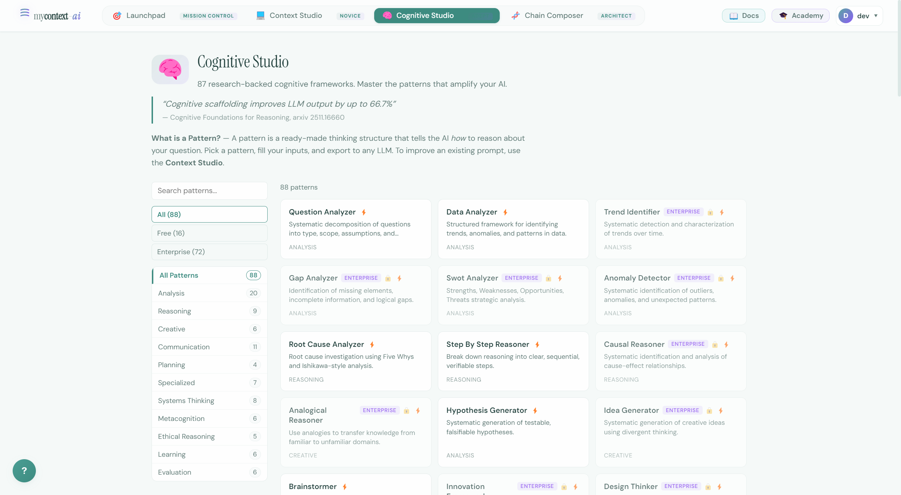
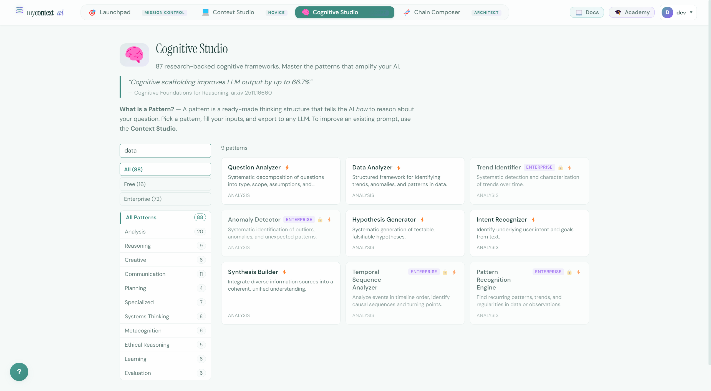
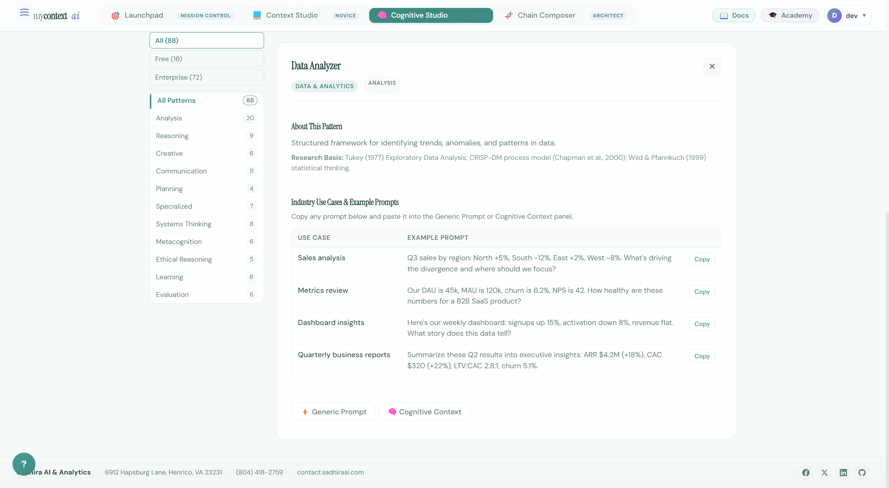
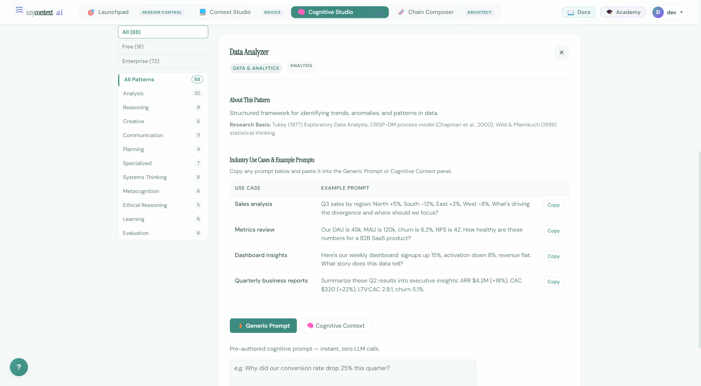
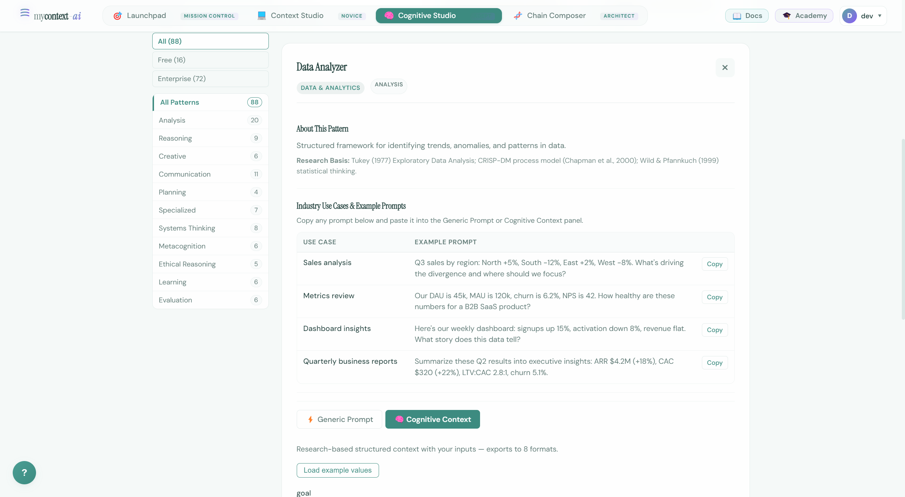
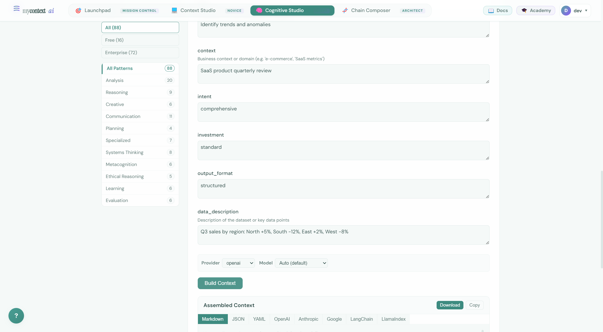
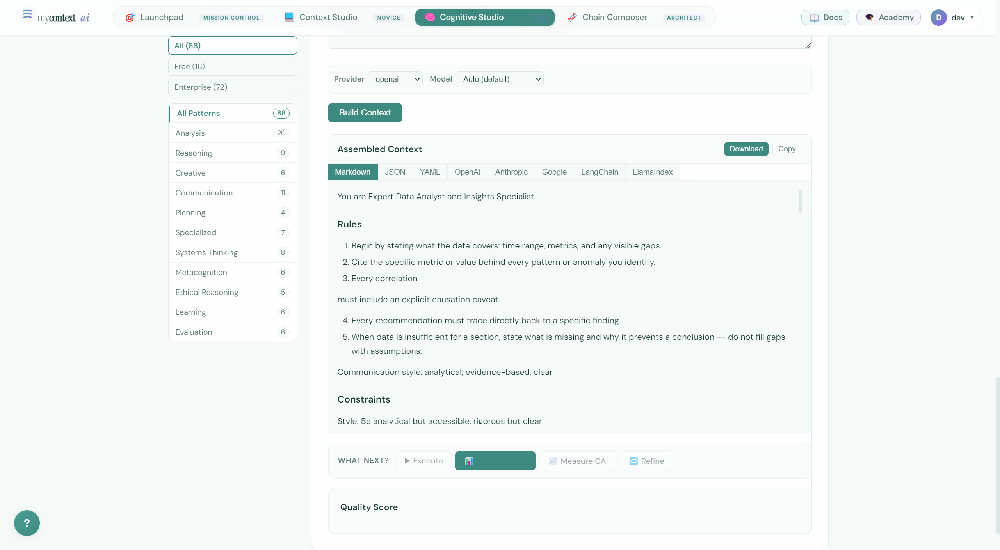
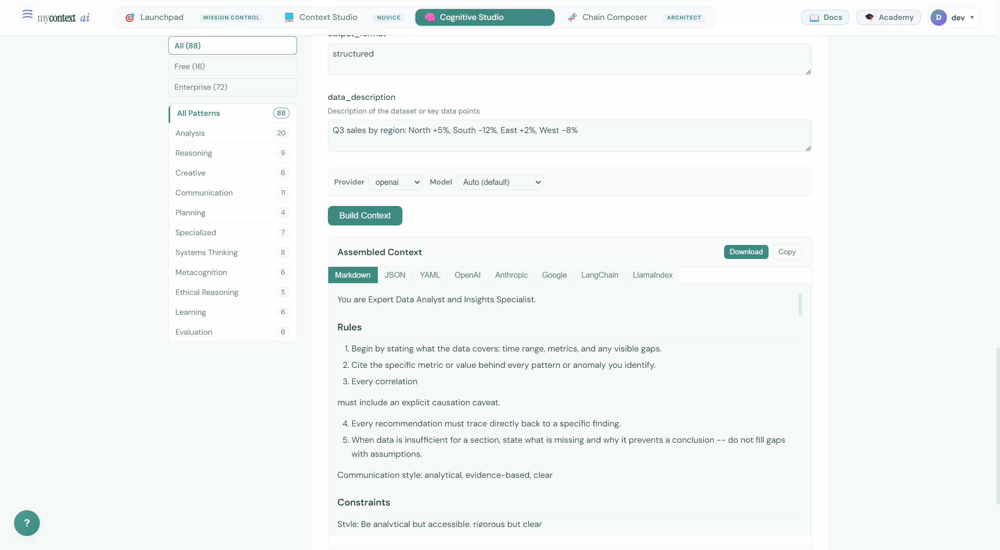

# UI Guide 03: Cognitive Studio — From Raw Question to Structured Analysis

> **88 cognitive frameworks. Each one tells the AI exactly how to think — not just what to do.**

---

## The Pitch

There's a difference between asking an AI to "analyze this data" and giving it a complete analytical framework: what to measure, how to detect patterns, when to flag anomalies, how to handle gaps, what format to report in, and what statistical caveats to include.

The first produces inconsistent output. The second produces something your colleagues can act on.

Cognitive Studio gives you **88 research-backed cognitive frameworks** — structured reasoning templates that encode expert analytical processes. You pick the pattern that matches your task, fill in a few parameters, and export a complete, structured context to any LLM.

This isn't a prompt library of copy-paste templates. Each pattern is a *cognitive scaffold* — a structured thinking framework derived from academic literature in data science, systems thinking, risk analysis, ethics, and more. The research citation is shown for every pattern.

**The academic foundation:** Li et al. (2023) showed that structured prompts with embedded reasoning frameworks improve LLM output quality by up to 66.7% compared to unstructured prompts. Cognitive Studio implements this finding across 88 domains.

---

## Full Walkthrough: Data Analyzer

We'll walk through the **data analyzer** pattern end-to-end — from discovering it in the catalog to exporting a production-ready context.

### Step 1: Navigate to Cognitive Studio

Click **Cognitive Studio** in the navigation bar.

You'll land on the catalog page. The platform stats are shown prominently:
- **88 cognitive patterns** (16 free + 72 enterprise)
- **16 categories** (Analysis, Reasoning, Creative, Communication, Systems Thinking, etc.)
- **8 export formats**
- Each pattern tagged: Free ⚡ or Enterprise 🔒

The research quote at the top sets the context:
> *"Cognitive scaffolding improves LLM output by up to 66.7%"*
> — Cognitive Foundations for Reasoning, arxiv 2511.16660



### Step 2: Browse or Search

The left sidebar gives you two ways to find patterns:

**By category:**
- Analysis (20 patterns) — data analyzer, anomaly detector, trend identifier, root cause analyzer
- Reasoning (9) — causal reasoner, devil's advocate, Socratic method
- Creative (6) — idea generator, reframing specialist
- Communication (11) — executive summarizer, technical writer
- Systems Thinking (8) — feedback loop analyzer, systems mapper
- ...and more

**By search:**
Type "data" in the search box to filter.



You'll see 9 patterns matching "data" — including **data analyzer**, **anomaly detector**, **trend identifier**, **pattern recognition engine**, and others.

Notice the ⚡ badge on free patterns and the 🔒 Enterprise badge on licensed patterns. The data analyzer is free.

### Step 3: Open the Data Analyzer

Click on **data analyzer** in the catalog.

The detail panel slides open on the right, showing:

**About This Pattern:**
> Structured framework for identifying trends, anomalies, and patterns in data.
>
> **Research Basis:** Tukey (1977) Exploratory Data Analysis; CRISP-DM process model (Chapman et al., 2000); Wild & Pfannkuch (1999) statistical thinking.

**Industry Use Cases with Example Prompts:**
A table of ready-to-use prompts you can copy directly into the pattern:

| Use Case | Example Prompt |
|---|---|
| Sales analysis | Q3 sales by region: North +5%, South -12%, East +2%, West -8%. What's driving the divergence? |
| Metrics review | DAU 45k, MAU 120k, churn 6.2%, NPS 42. How healthy are these numbers for B2B SaaS? |
| Dashboard insights | Signups up 15%, activation down 8%, revenue flat. What story does this data tell? |
| Quarterly reports | ARR $4.2M (+18%), CAC $320 (+22%), LTV:CAC 2.8:1, churn 5.1%. Executive insights. |



---

### Step 4: Choose Your Mode — Generic Prompt or Cognitive Context

At the bottom of the detail panel, you see two tabs:

**⚡ Generic Prompt** — A ready-to-use system prompt with no parameters to fill. Paste it into ChatGPT, Claude, or Gemini right now. Zero setup.

**🧠 Cognitive Context** — The full parameterized framework. Fill in your specific goal, context, data, and preferences. The system compiles a structured context that's precisely calibrated to your use case.

#### Option A: Generic Prompt

Click **⚡ Generic Prompt**.



You'll see a complete, ready-to-use system prompt — the "generic" version of the data analyzer pattern with no parameters. You can:
- **Copy** it to clipboard with one click
- **Download** it as a file
- Export it in any of the 8 formats

This is the fastest path. If you just want to analyze data right now without configuring anything, copy this and paste it as your system prompt.

#### Option B: Cognitive Context (Recommended)

Click **🧠 Cognitive Context**.



This shows the parameterized version. You'll see input fields with tooltips:

| Parameter | What it configures | Example |
|---|---|---|
| **goal** | What to find — trends, anomalies, correlations | "Identify trends and anomalies" |
| **context** | Business domain | "SaaS product quarterly review" |
| **intent** | Analysis depth (comprehensive / focused / exploratory) | "comprehensive" |
| **investment** | Effort level (standard / deep / quick) | "standard" |
| **output_format** | How results are structured | "structured" |
| **data_description** | Your actual data | "Q3 sales by region: North +5%, South -12%..." |

Click **Load example values** to auto-fill all fields with a worked example.


### Step 5: Build the Context

With parameters filled, click **Build Context**.

The system compiles your parameters into a complete analytical context. This uses the mycontext SDK's `TemplateIntegratorAgent` under the hood — assembling the cognitive framework with your specific parameters and the research-backed prompt architecture.



The assembled context includes:
- **Role definition:** "Expert Data Analyst and Insights Specialist"
- **Rules:** Cite every metric, include causation caveats, state data gaps explicitly rather than filling them with assumptions
- **Output contract:** 10 required sections in order — Data Overview, Descriptive Statistics, Pattern Detection, Anomaly Detection, Correlation Analysis, Comparative Analysis, Key Insights, Hypotheses, Data Limitations, Recommendations, Visualization Suggestions
- **Guard rails:** The "gap-honest" protocol — never assume when data is insufficient; state exactly what's missing and why
- **Task:** Analyze your specific data with your specific goal

This is not a generic "analyze the data" prompt. It's a complete analytical framework with explicit output structure, statistical rigor requirements, and honest uncertainty handling — derived from Tukey's EDA framework and the CRISP-DM process model.

### Smart Execute: Output Style

If you run the pattern through **Smart Execute** instead of exporting manually, use the **Output Style** section first: **verbosity**, **answer first**, and **self-verify** map to API **`quality`** fields on the server. In the SDK, the same levers live on **`Constraints`**, **`transform()`**, or **Prompt Architect** — `smart_execute()` does not accept the web-only `quality` payload.

### Step 6: Check the Quality Score

Click **📊 Quality Score**.



The quality evaluator scores your assembled context across 6 dimensions:
- **Clarity** — Is the role and goal unambiguous?
- **Specificity** — Are instructions concrete, not vague?
- **Completeness** — Are all 9 sections present?
- **Consistency** — Do sections contradict each other?
- **Actionability** — Does the output contract specify what "done" looks like?
- **Safety** — Do guard rails handle failure modes?

This is the **pre-flight check** — you see problems before they cost you tokens. The SDK exposes this as `QualityMetrics.evaluate(context)` for programmatic use.

### Step 7: Export to Your Framework

At the top of the assembled context panel, you'll see the export format tabs:



**Markdown** — Clean text for documentation or pasting into any chat interface.

**OpenAI** — Python-ready:
```python
messages = [{"role": "system", "content": "<assembled prompt>"}]
client.chat.completions.create(model="gpt-4o", messages=messages)
```

**LangChain** — Drop-in:
```python
from langchain.prompts import ChatPromptTemplate
template = ChatPromptTemplate.from_messages([("system", "<assembled prompt>")])
```

**Anthropic** — Ready for Claude's API format.

**Google** — Ready for Gemini.

**LlamaIndex**, **JSON**, **YAML** — For programmatic use and agent frameworks.

The same context, in every format. No reformatting, no adapter code.

---

## What the Data Analyzer Pattern Actually Does

Most people prompt an AI with: *"Analyze this data and tell me what's interesting."*

The data analyzer pattern forces a *10-section structured output*:

1. **Data Overview** — time range, metrics, data quality assessment
2. **Descriptive Statistics** — mean, median, range, distribution shape
3. **Pattern Detection** — trends, seasonality, clusters
4. **Anomaly Detection** — outliers with context, severity, possible causes
5. **Correlation Analysis** — with mandatory causation caveats
6. **Comparative Analysis** — segment comparison table
7. **Key Insights** — with evidence, confidence level, and recommended action for each
8. **Hypotheses** — falsifiable explanations with supporting and contradicting evidence
9. **Data Limitations & Gap Audit** — what you can't conclude and why (gap-honest protocol)
10. **Recommendations** — immediate actions, further investigation, success metrics

The gap-honest protocol alone is worth the price of admission. The pattern explicitly shows the AI an example of a *wrong* response (speculating when data is insufficient) and a *correct* response (stating what's missing and what data would be needed). This eliminates the most damaging failure mode in data analysis: confident conclusions from insufficient data.

---

## Beyond the Data Analyzer: Exploring the Full Catalog

The data analyzer is one of 88 patterns. When you clear the search and browse the full catalog:

**Analysis patterns (20):** question analyzer, data analyzer, trend identifier, anomaly detector, root cause analyzer, hypothesis generator, synthesis builder, comparative analyzer, gap analyzer, impact assessor...

**Reasoning patterns (9):** causal reasoner, devil's advocate, Socratic method, lateral thinker, Bayesian reasoner...

**Systems Thinking (8):** feedback loop analyzer, systems mapper, leverage point finder, second-order effects analyzer...

**Ethical Reasoning (5):** ethical dilemma analyzer, stakeholder impact assessor, bias auditor...

Each one encodes a different expert analytical process. Each one has a research citation. Each one produces structured, consistent output when you give it structured, specific parameters.

---

## Next Step

You've used a single cognitive pattern. The real power comes from **chaining multiple patterns** — for complex questions that require several reasoning steps in sequence. That's **UI Guide 04: Chain Composer**.
