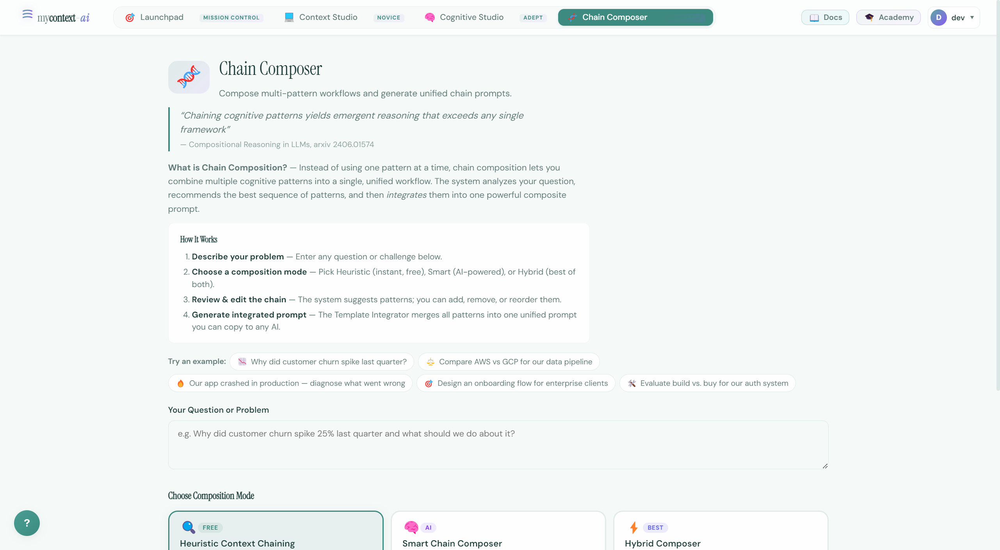
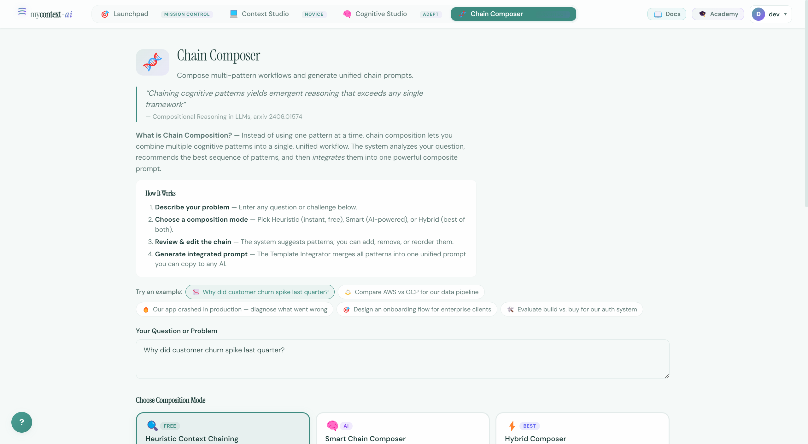
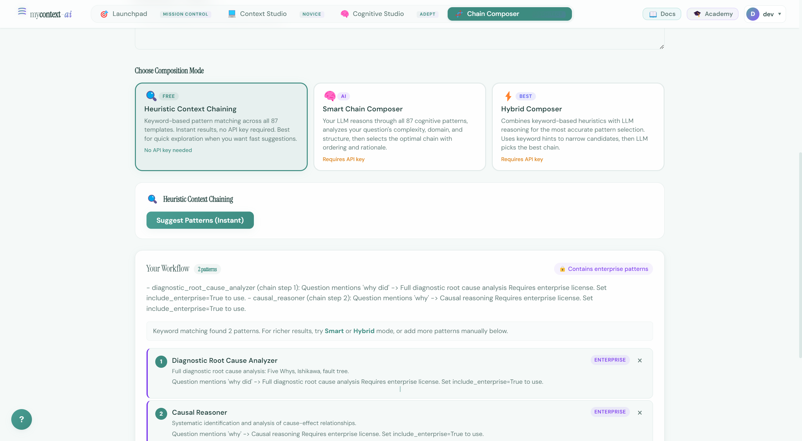
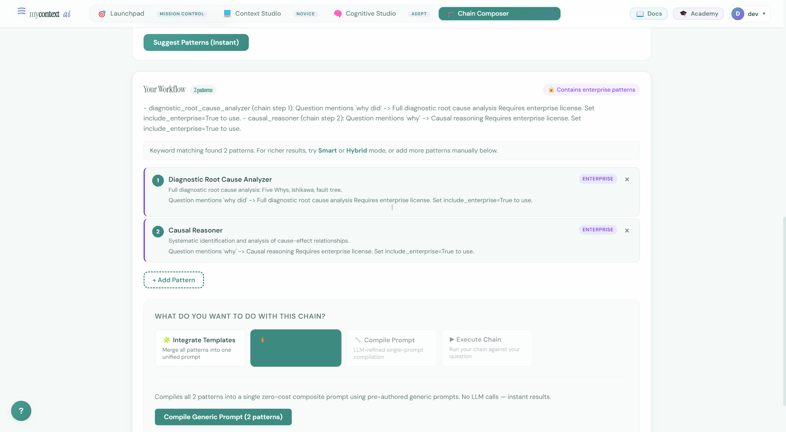

# UI Guide 04: Chain Composer — Multi-Pattern Reasoning for Complex Problems

> **One pattern answers one kind of question. Complex problems need a sequence. Chain Composer builds it for you.**

---

## The Pitch

Some questions are simple enough for a single cognitive framework: "Analyze this dataset." "Summarize this meeting." "Review this code."

But real-world problems aren't that clean. "Why did customer churn spike last quarter and what should we do about it?" — that's not a data analysis question. It's a causal diagnosis, followed by a trend analysis, followed by a risk assessment, followed by a strategic recommendation. Four different reasoning frameworks, in the right order, each one building on the previous.

You could apply each pattern manually, one at a time, copying results between sessions. Or you could use Chain Composer.

Chain Composer analyzes your question, recommends the best sequence of cognitive patterns from the 88-template catalog, and then merges them into a single unified prompt. One input, one output, orchestrated reasoning.

**The research:** Compositional reasoning — chaining specialized cognitive frameworks — consistently outperforms any single framework on complex tasks (arxiv 2406.01574). Chain Composer implements this with automatic pattern selection and template integration.

---

## What Chain Composer Does (in 4 Steps)

1. **You describe your problem** — any question, any complexity
2. **You choose a composition mode** — Heuristic (instant, free), Smart (AI-powered), or Hybrid (most accurate)
3. **The system suggests a pattern chain** — you can add, remove, or reorder
4. **You generate the integrated prompt** — one unified prompt from all patterns, ready to paste anywhere

---

## Full Walkthrough: Customer Churn Analysis

### Step 1: Navigate to Chain Composer

Click **Chain Composer** in the navigation bar.

You'll see the landing page with:
- A clear explanation of chain composition
- Example questions to try
- The question input box
- Three composition mode cards

The research quote sets the frame:
> *"Chaining cognitive patterns yields emergent reasoning that exceeds any single framework"*
> — Compositional Reasoning in LLMs, arxiv 2406.01574



### Step 2: Enter Your Question

You can either:
- Type your own question in the text box
- Click one of the **example chips** to auto-fill a tested question

The example chips include real-world scenarios:
- "📉 Why did customer churn spike last quarter?"
- "⚖️ Compare AWS vs GCP for our data pipeline"
- "🔥 Our app crashed in production — diagnose what went wrong"
- "🎯 Design an onboarding flow for enterprise clients"
- "🛠️ Evaluate build vs. buy for our auth system"

Click **📉 Why did customer churn spike last quarter?**



### Step 3: Choose Composition Mode

Three modes are available:

#### 🔍 Heuristic (Free, Instant)
Keyword-based pattern matching across all 87 templates. No API key required. Returns results instantly.

Best for: Quick exploration, seeing what patterns apply to your question before committing an API call.

#### 🧠 Smart (AI-powered)
Your LLM reasons through all 87 patterns, analyzes your question's complexity, domain, and structure, then selects the optimal chain with ordering rationale.

Best for: Accurate pattern selection when you want the AI to understand the semantic nuance of your question.

#### ⚡ Hybrid (Most Accurate)
Keyword heuristics narrow the candidate pool, then the LLM picks the best chain from the candidates. Faster than Smart (fewer patterns to reason over) and more accurate than Heuristic (LLM validates the matches).

Best for: Production use when you want the best possible chain and have a key available.

For this walkthrough, we'll use **Heuristic** — it's free, instant, and shows how pattern matching works.

The mode selector is already set to Heuristic. Click **Suggest Patterns (Instant)**.

### Step 4: Review the Suggested Chain

The system returns a chain of patterns matched to your question:



For "Why did customer churn spike last quarter?", the heuristic matcher identifies:

| # | Pattern | Why it matched |
|---|---|---|
| 1 | **diagnostic root cause analyzer** | "why did" → Five Whys, Ishikawa, fault tree analysis |
| 2 | **causal reasoner** | "why" → systematic cause-effect identification |

You can see the chain displayed as numbered steps with explanations for why each pattern was included.

**What you can do with the chain:**
- Click **×** on any pattern to remove it
- Click **+ Add Pattern** to add patterns from the catalog manually
- Drag to reorder (if more than 2 patterns)
- View the Enterprise badge on locked patterns

Below the chain, four action buttons tell you what you can do next:

| Button | What it does | API key needed? |
|---|---|---|
| 🧩 Integrate Templates | Merge all patterns into one unified AI-integrated prompt | Yes |
| ⚡ Compile Generic | Zero-cost composite prompt — rule-based merge, no LLM calls | No |
| 🔧 Compile Prompt | LLM-refined single-prompt compilation | Yes |
| ▶ Execute Chain | Run the chain against your question | Yes |

### Step 5: Compile Generic (No Key Needed)

Click **⚡ Compile Generic**.



The result is a single unified prompt that combines the diagnostic root cause analyzer and causal reasoner frameworks — merged without any LLM call. This is the **TemplateIntegratorAgent** running in generic mode (equivalent to `chain.compile_generic()` in the SDK).

The compiled prompt includes:
- A combined role that covers both diagnostic and causal reasoning
- Merged rules from both patterns with deduplication
- A unified output contract that covers both frameworks' required sections
- The question embedded as the task

This prompt can be copied and used directly in ChatGPT, Claude, Gemini, or any other LLM.

---

## The Three Composition Modes — When to Use Each

### When to use Heuristic
- You're exploring: "What patterns even apply to this type of question?"
- You want instant results without an API call
- You're iterating on the question wording before committing

### When to use Smart
- Your question has semantic complexity that keyword matching can miss
- Example: "Assess whether our new pricing strategy creates ethical concerns for underserved customers" — keyword matching would miss "ethical reasoning" + "stakeholder impact" + "causal analysis" as the right chain

### When to use Hybrid
- You want the most accurate results
- You're building something for production or sharing with a team
- The incremental cost of an API call is justified by the accuracy improvement

---

## The Four Output Actions

### 🧩 Integrate Templates (Recommended for most uses)
The **TemplateIntegratorAgent** takes all patterns in your chain and uses an LLM to merge them intelligently — resolving conflicts between sections, removing redundancy, and producing a coherent unified prompt that reads as one document, not a concatenation.

This is different from Compile Generic: the integration is semantic, not mechanical. The result flows naturally.

### ⚡ Compile Generic
Rule-based concatenation of all patterns' generic prompts. No LLM call, no cost. Faster, slightly more mechanical. Good for quick prototyping or when you want a free option.

### 🔧 Compile Prompt
LLM-refined compilation focused on producing a single, clean system prompt. Similar to Integrate Templates but optimized for compactness and coherence over completeness.

### ▶ Execute Chain
Run the complete chain against your question — the system applies each pattern in sequence, passing context between steps. The final output is the synthesis of the full reasoning chain.

---

## Add Pattern Manually

If the suggested chain is missing something you know you need, click **+ Add Pattern**.

A search overlay opens — you can search the full 88-pattern catalog and add any pattern to your chain. Patterns are added at the end by default; you can drag to reorder.

Example: The heuristic matched diagnostic + causal patterns for the churn question. But you might also want to add:
- **trend identifier** — to quantify the churn trend over time
- **risk assessor** — to evaluate downstream business impact
- **synthesis builder** — to integrate the findings into a single executive narrative

A 5-pattern chain is not unusual for complex strategic questions.

---

## Export from Chain Composer

Once you've compiled or integrated your chain, the output panel shows the same 8 export format tabs as Cognitive Studio:

**OpenAI, Anthropic, Google, LangChain, LlamaIndex, Markdown, JSON, YAML**

The same unified prompt, in the format your team needs. No reformatting.

---

## The SDK Equivalent

Everything you do in Chain Composer maps directly to SDK operations:

```python
from mycontext import suggest_patterns, TemplateIntegratorAgent

# Heuristic pattern suggestion
result = suggest_patterns(
    "Why did customer churn spike last quarter?",
    suggest_chain=True
)
# result.patterns = ["diagnostic_root_cause_analyzer", "causal_reasoner"]
# result.rationale = why each pattern was selected

# Integrate templates
agent = TemplateIntegratorAgent()
integrated = agent.integrate(
    patterns=result.patterns,
    question="Why did customer churn spike last quarter?"
)
# integrated.prompt = the unified system prompt
```

Chain Composer is the visual interface for this pipeline. The SDK lets you automate it.

---

## Putting It All Together

You've now completed the full mycontext journey:

| Guide | What you built | Equivalent SDK |
|---|---|---|
| 01 Pit Stop | Diagnosed a weak prompt, identified 7 missing sections | `PromptArchitect.parse()` + `improve()` |
| 02 Context Studio | Built a complete 9-section production prompt | `PromptArchitect.build()` + wizard |
| 03 Cognitive Studio | Applied the data analyzer framework with full parameterization | `transform()` + `QualityMetrics` |
| 04 Chain Composer | Composed a multi-pattern reasoning chain for a complex problem | `suggest_patterns()` + `TemplateIntegratorAgent` |

Each guide builds on the previous. The platform is designed as a progressive journey from novice (Context Studio) to adept (Cognitive Studio) to architect (Chain Composer) — but each feature is also independently useful.

For the code-based equivalent of all of this, see the **Notebook Series** in the content-series folder.
